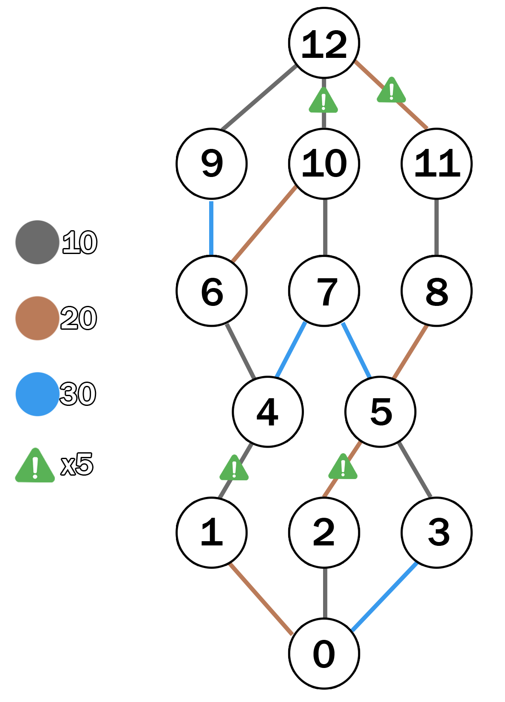

# AyP2: Práctica de grafos

## El contexto...

Últimamente estuve mucho tiempo jugando a Darkest Dungeon 2, un juego rogue-like por turnos, en el que se avanza con un
carruaje por un mapa.

El jugador va tomando decisiones sobre por donde avanzar en base a los encuentros que se avecinan. Algunos lugares
tienen encuentros contra monstruos, otros tienen tiendas, y algunos caminos **rompen** el carruaje conforme se avanza
por él.

Esta parte de "cuál es el camino más óptimo para avanzar" es crucial para poder llegar al final.

(PD: No recomiendo este juego a nadie que tenga poca paciencia...)

## El ejercicio:

Simplificando muchos aspectos, se tiene el siguiente mapa del nivel actual. El objetivo es llegar desde el comienzo (
nodo 0) al final (nodo 12, en este caso, pero pueden ser más).

  

Sin embargo, no todos los caminos son igual de óptimos:

1. Los caminos de **PIEDRA** (color gris) cuestan 10 para avanzar.
2. Los caminos de **TIERRA** (color marrón) cuestan 20 para avanzar.
3. Los caminos de **AGUA** (color azul) cuestan 30 para avanzar.

Hasta acá es fácil, pero como mencione anteriormente, algunos caminos **rompen** el carruaje. Estos caminos están
marcados con un signo de peligro.

Pasar por un camino peligroso con un carruaje en buenas condiciones no cuesta más, pero lo **rompe**. Pasar por un
camino peligroso con un carruaje ya roto **multiplica el costo de ese camino por 5**.

El objetivo es, usando teoría de grafos, encontrar el mejor camino para avanzar, considerando todo lo anterior.

### Una simplificación para resolver en clase:

Como este ejercicio se puede complejizar muy rápidamente, vamos a aproximar un poco. La mejor solución va a implicar
esquivar de antemano caminos peligrosos (esto se deja como desafío altamente complicado para el que quiera intentar).
Para la clase, vamos a simplemente **cambiar la estrategia de búsqueda** una vez detectamos que se rompe el carruaje.